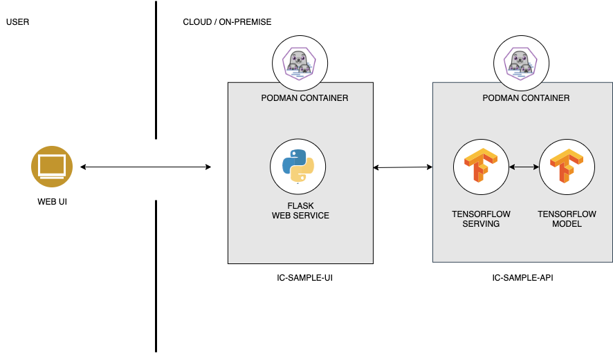

# ic-sample-api

Image Classifcation API Example using ImageNet pretrained ResNet50/Xception model and tensorflow serving 

## Architecture



## Prerequisites

* OpenShift 4
* OpenShift Pipeline Operator installed

## Deployment steps

Create project
```bash
$ oc new-project ic-pipelines
```
Create PVC for model / git-sources
```bash
$ oc create -f pipeline/model_pvc.yaml
```
Create save model task
```bash
$ oc create -f pipeline/save_model_task.yaml
```
Create apply manifests task
```bash
$ oc create -f pipeline/apply_manifest_task.yaml
```
Create pipeline
```bash
$ oc create -f pipeline/pipeline.yaml
```
Check task, clustertask, pipeline list
```bash
$ tkn task list
$ tkn clustertask list
$ tkn pipeline list
```
Run pipeline
```bash
$ tkn pipeline start model-save-and-deploy -w name=shared-workspace,claimName=model-pv-claim -p deployment-name=ic-sample-api -p git-url=https://github.com/duss023/ic-sample-api.git --use-param-defaults
```

## References

* [OpenShift Pipelines Tutorial](https://github.com/openshift/pipelines-tutorial)
